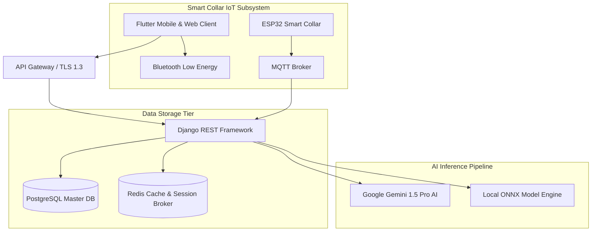

# Master System Architecture Diagrams - PetConnect AI Ecosystem v2.7.0

Collection of publication-grade UML diagrams: System Architecture, ER Diagram, Component Diagram, Sequence Diagram, and AI Pipeline.

---

## 🏛️ 1. Complete System Architecture

