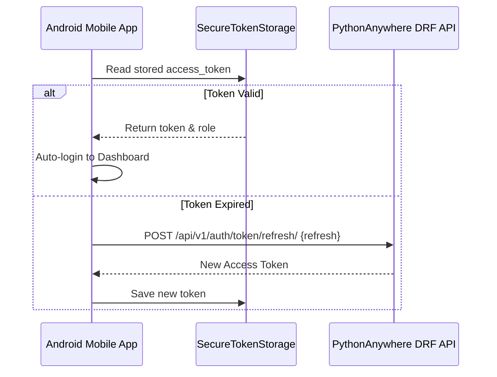

# Mobile Authentication Flow (v2.2.0) - PetConnect AI Ecosystem

Sequence breakdown of **Mobile JWT Authentication**, **Auto-Login**, and **Role-Based Navigation**.

```mermaid
sequenceDiagram
    participant App as Android Mobile App
    participant Storage as SecureTokenStorage
    participant API as PythonAnywhere DRF API

    App->>Storage: Read stored access_token
    alt Token Valid
        Storage-->>App: Return token & role
        App->>App: Auto-login to Dashboard
    else Token Expired
        App->>API: POST /api/v1/auth/token/refresh/ {refresh}
        API-->>App: New Access Token
        App->>Storage: Save new token
    end
```
