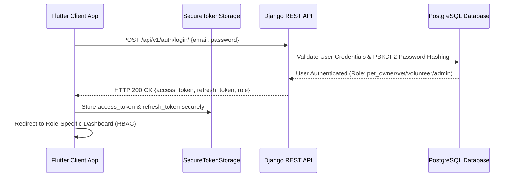

# Authentication Architecture & Security Guide (v2.2.0) - PetConnect AI Ecosystem

Comprehensive guide covering **JWT Token Authentication**, **Role-Based Access Control (RBAC)**, **Secure Token Storage**, and **API Endpoints**.

---

## 🔐 1. Authentication Architecture

The **PetConnect AI Ecosystem** utilizes Stateless JSON Web Tokens (JWT) powered by `djangorestframework-simplejwt`.

---

## 🔑 2. JWT API Endpoints

| Endpoint URL | HTTP Method | Request Body | Description |
| :--- | :---: | :--- | :--- |
| `/api/v1/auth/login/` | `POST` | `{email, password}` | Authenticates user & returns JWT tokens + user role |
| `/api/v1/auth/register/` | `POST` | `{full_name, email, phone, password, role}` | Registers new account & sends verification OTP |
| `/api/v1/auth/token/refresh/` | `POST` | `{refresh}` | Issues new short-lived access token |
| `/api/v1/auth/verify-otp/` | `POST` | `{email, otp}` | Activates unverified accounts |
| `/api/v1/auth/forgot-password/` | `POST` | `{email}` | Sends password reset OTP to email |
