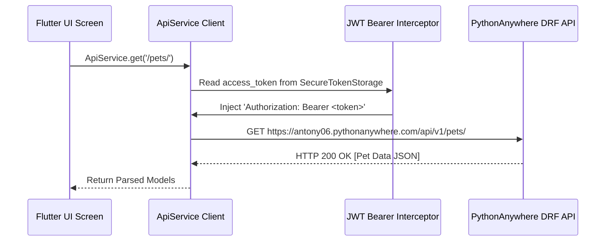

# Network Architecture & Interceptor Specification - PetConnect AI Ecosystem v2.4.0

Technical specification for centralized HTTP networking (`ApiService`), Dio/HTTP client interceptors, JWT header injection, and retry policies.

---

## 🌐 Network Interceptor Stack

