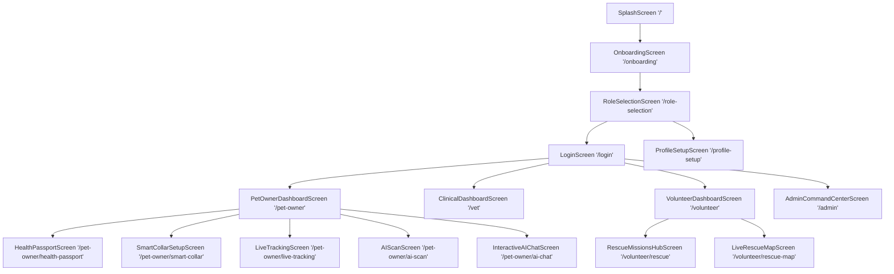

# Screen Hierarchy & Mapping Document - PetConnect AI Ecosystem v2.3.0

Complete screen hierarchy mapping every route from Entry point to Child Pages, Detail Pages, Edit Modals, and Return Navigation paths.

---

## 🌳 Application Screen Hierarchy

