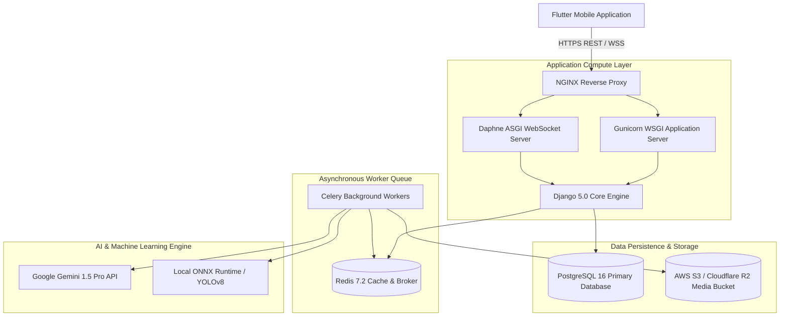

# System Architecture Guide - PetConnect AI Ecosystem

Comprehensive system architecture design for the **PetConnect AI Ecosystem**, detailing client presentation, backend microservices, data persistence, IoT streaming, and AI inference engines.

---

## 1. High-Level System Architecture

---

## 2. Core Architectural Layers

1. **Flutter Mobile Application (`lib/src/`)**:
   - Built on Flutter 3.22.0 adhering to Clean Architecture (`presentation/`, `domain/`, `data/`).
   - Managed by Riverpod 2.x, GoRouter 14.x navigation, and Material 3 design systems.
2. **Django Backend Application (`backend/`)**:
   - Built on Django 5.0 & DRF 3.15, separated into 13 domain apps (`accounts`, `pets`, `health_passport`, `smart_collar`, `ai_scan`, `rescue`, `admin_dashboard`).
   - Implements strict Service-Repository-Selector patterns.
3. **Smart Collar IoT Subsystem**:
   - Dual-model architecture: `SmartCollarDeviceStatus` (live telemetry cache) and `SmartCollarTelemetryHistory` (immutable time-series history log).
   - Real-time Haversine distance geofence breach detection.
