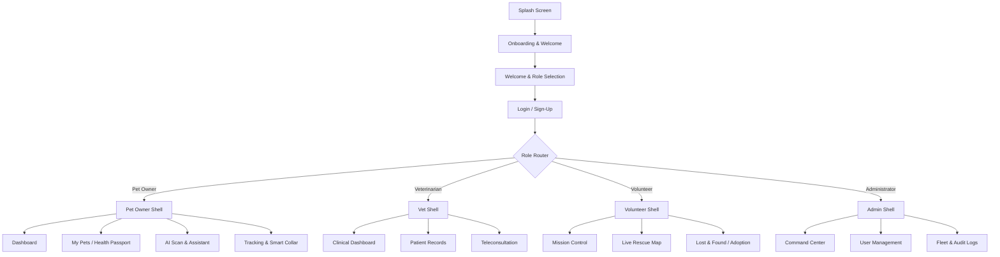

# Implementation Plan - PetConnect AI Ecosystem

Architecture, Design System Audit, and Phased Implementation Plan for **PetConnect AI**, based directly on the authoritative Stitch MCP design project (`projects/12891241512490746499`).

> [!IMPORTANT]
> **Phase 1 Analysis & Phase 2 Architecture Phase**
> In accordance with your directives, NO Flutter code will be written until you have reviewed and approved this comprehensive analysis report and implementation plan.

---

## Phase 1 - Analysis Report

### 1. Total Number of Screens Detected
* **Total Screen Artifacts**: 57 items detected in the Stitch project.
* **Core Mobile Screens & Flow Views**: 51 functional screens spanning all 4 portals, authentication, AI diagnostics, and system settings.
* **Graphic & Illustration Assets**: 6 dedicated asset render boards (3D Smart Collar pedestal, 3D Pet Care Avatars, 3D AI Brain/Noseprint, PetConnect AI Brand Logo, Shader preview canvas, Three.js blueprint).

---

### 2. Screen Hierarchy & Portal Grouping

```
PetConnect AI Ecosystem
│
├── 🔐 Authentication & Onboarding (5 Screens)
│   ├── Splash Screen (Animated)
│   ├── Onboarding & Welcome Flow
│   ├── Welcome & Role Selection
│   ├── Login, Sign-Up & Verification
│   └── Profile Setup & Permissions
│
├── 🐾 Pet Owner Portal (16 Screens)
│   ├── Dashboard (Home Vitals & Summary)
│   ├── My Pets (Pet Management & Profiles)
│   ├── Health Passport (Vaccinations & Medical Timeline)
│   ├── Smart Collar Setup (BLE Pairing & Calibration)
│   ├── Live Tracking (Real-time GPS & Geofence)
│   ├── Growth & Nutrition Analytics (Weight & Diet Charts)
│   ├── Interactive AI Chat (Symptom & Care Assistant)
│   ├── Voice Assistant Interface (Hands-free Voice Commands)
│   ├── AI Scan & Identify (Visual Noseprint & Skin Scan)
│   ├── AI Diagnostic Center (Lab Analysis & Predictive Health)
│   ├── AI Search & Verification (Medical Knowledge Lookup)
│   ├── AI Assistant Home (Prompt Hub & Quick Actions)
│   ├── AI Assistant Settings (Custom Personalities & Models)
│   ├── Appointments & Calendar (Vet Consultations Schedule)
│   ├── Notifications & Treatment Ledger (Meds & Reminders)
│   └── Conversation History (Past AI & Vet Conversations)
│
├── 🩺 Veterinarian Portal (7 Screens)
│   ├── Clinical Dashboard (Patient Queue & Daily Schedule)
│   ├── Patient Records (Detailed Medical History & EHR)
│   ├── Teleconsultation Hub (Video Call & Live Telemetry)
│   ├── Prescription Generator (Digital Rx & Dosage Calc)
│   ├── Lab & Analytics Hub (Bloodwork & Imaging Diagnostics)
│   ├── Emergency Case Management (Triage & Urgent Intake)
│   └── Clinic & App Settings (Clinic Profile & Staff Roles)
│
├── 🚨 Volunteer & Rescue Portal (8 Screens)
│   ├── Volunteer Dashboard (Mission Control Center)
│   ├── Volunteer Community & Events (Fosters & Meetups)
│   ├── Volunteer Communication Hub (Team Chat & Dispatch)
│   ├── Rescue Missions Hub (Active Alert Incidents)
│   ├── Live Rescue Map (Interactive GPS Map & Radar)
│   ├── Lost & Found Hub (AI Facial Matching for Strays)
│   ├── Adoption Center (Pet Applications & Fosters)
│   └── Volunteer Profile & Impact (Badges, Hours & Milestones)
│
├── 🛠️ Administrator Portal (6 Screens)
│   ├── Admin Command Center Dashboard (System Health & Metrics)
│   ├── Admin User Management Directory (Users, Vets, Fosters)
│   ├── Admin Security & Audit Center (Logs, Roles & Access Control)
│   ├── Admin Revenue & Finance Dashboard (Subscriptions & Payouts)
│   ├── Admin AI & Model Performance (Accuracy, Latency & Tokens)
│   └── Admin Smart Collar Fleet Management (Device OTA & Status)
│
└── 🌐 System, Settings & Utilities (9 Screens)
    ├── Universal Search & Suggestions (Global Search overlay)
    ├── Global System Settings (Theme, Security, Language)
    ├── Help Center & Support Hub (FAQ & Live Agent Support)
    ├── Privacy, Terms & Legal Docs (Compliance & GDPR)
    ├── Dialogs, Sheets & Feedback UI (Collection of overlays)
    └── System States & Edge Cases (Offline, Empty, Error screens)
```

---

### 3. Navigation Flow



---

### 4. User Roles Supported
1. **Pet Owner**: Manages pet health passports, smart collars, AI symptom checking, vet appointments, and lost pet broadcasts.
2. **Veterinarian**: Accesses clinical EHRs, teleconsultations, Rx generator, lab diagnostic analysis, and clinic management.
3. **Volunteer / Rescue Worker**: Manages stray rescues, live incident dispatch maps, lost & found matching, adoption applications, and community events.
4. **Administrator**: Oversees whole-platform telemetry, fleet status, user permissions, audit logs, financial analytics, and AI model performance.

---

### 5. Design System Overview & Aesthetic
* **Aesthetic Philosophy**: "Medical-Grade Tech" inspired by Apple Health clarity, Tesla UI precision, and Nothing OS glassmorphic/dot-matrix accents.
* **Grid System**: Strict 8pt base grid with a 4pt sub-grid for fine alignment.
* **Elevation & Depth**: Tonal layers combined with multi-layer Glassmorphism (20px backdrop blur with 5%-10% translucent white/dark strokes).

---

### 6. Shared Components & 7. Reusable Widgets
* **`GlassmorphicHeader`**: Blurred sticky app bar with status indicators and search triggers.
* **`PetVitalsCard`**: Real-time telemetry card displaying heart rate, temperature, activity level, and sparkline graphics.
* **`AIInsightBanner`**: Gradient-bordered container highlighting AI diagnostic summaries and recommendations.
* **`StatusChip`**: Compact pill for online/offline, medical priority (Urgent/Stable), and rescue status.
* **`RoleSelectorTile`**: Interactive card with tactile selection feedback for role onboarding.
* **`MedicalTimelineItem`**: Timeline node for vaccine history, surgery logs, and prescription records.
* **`RescueMapMarker`**: Custom map pin with pet photo thumbnail and live GPS pulsing indicator.

---

### 8. Typography Strategy

| Token Name | Font Family | Size | Weight | Line Height | Letter Spacing | Target Use |
| :--- | :--- | :--- | :--- | :--- | :--- | :--- |
| `display-lg` | Plus Jakarta Sans / Inter | 32px - 48px | Bold (700) | 56px | -0.02em | Hero headers & Onboarding titles |
| `headline-lg` | Plus Jakarta Sans | 32px | SemiBold (600) | 40px | -0.01em | Section headers |
| `headline-md` | Plus Jakarta Sans | 24px | SemiBold (600) | 32px | Normal | Card titles & Screen headers |
| `title-lg` | Plus Jakarta Sans | 18px - 20px | Medium (500) | 24px | Normal | Subheadings & List section headers |
| `body-lg` | Inter | 16px | Regular (400) | 24px | Normal | Paragraph text & Descriptions |
| `body-md` | Inter | 14px | Regular (400) | 20px | Normal | Compact body & Input field text |
| `label-lg` | Inter | 12px | SemiBold (600) | 16px | +0.05em | Buttons & Tag labels |
| `mono-data` | Manrope / Inter | 14px | Medium (500) | 20px | -0.01em | Telemetry metrics & GPS coordinates |

---

### 9. Color Tokens & 10. Theme Implementation

```yaml
Colors:
  Primary Teal: '#00685F' (Light) / '#6BD8CB' (Dark)
  Primary Container: '#008378'
  Secondary Cyan: '#00687A' / '#57DFFE'
  Tertiary Coral: '#924628' / '#FFB59A'
  Surface Light: '#F8F9FF'
  Surface Dark: '#050811'
  Surface Container Lowest: '#FFFFFF' (Light) / '#0B1C30' (Dark)
  Outline: '#6D7A77'
  Error: '#BA1A1A'
```

* **Light Theme**: Pristine white and cool slate (`#F8F9FF`) with dark teal text (`#0B1C30`) and subtle gray borders.
* **Dark Theme**: OLED-optimized dark navy (`#050811`) with glowing cyan telemetry badges and frosted glass containers.

---

### 11-27. Feature Audit Matrix

| Feature | Audit Finding in Stitch Project | Implementation Details |
| :--- | :--- | :--- |
| **Auto Layout Quality** | High-fidelity fluid flex layouts | 8pt padding grid with responsive constraints |
| **Animations** | Pulse radar, sparkline draws, page slides | `flutter_animate` & custom Rive/Lottie loops |
| **Assets & Graphics** | 3D Smart Collar, 3D Pet Avatars, 3D AI Brain | Assets stored under `assets/images/3d/` |
| **Icons** | 1.5pt linear stroke modern icon set | Lucide/Phosphor linear icon mapper |
| **Forms** | Pet EHR, Rx Generator, Incident Report | Flutter FormKey with Reactive Form Validators |
| **Dialogs & Sheets** | Modal bottom sheets, emergency popups | Custom M3 `showModalBottomSheet` templates |
| **Maps** | Rescue location & Smart Collar geofence | `google_maps_flutter` with custom marker icons |
| **Charts** | Vitals timeline, Weight progression, Revenue | `fl_chart` custom line & bar chart builders |
| **Accessibility** | AA High Contrast, 44px+ hit targets | Material 3 Semantics & Screen Reader labels |

---

### 28-31. Audit Observations & Challenges
* **Duplicate Screen Entry**: `Admin: Command Center Dashboard` appears twice in Stitch (`8df6130e...` and `5376087e...`). One represents the primary analytical layout and the second represents the dark mode / expanded filter state. Both will be unified into a single responsive screen.
* **Missing Direct Assets**: Native audio assets for the Voice Assistant interface (will use mock audio waveforms and Web Audio / JustAudio placeholders).
* **Flutter Implementation Challenges**: Efficient backdrop blur rendering on mid-range Android devices. Solved by enabling performance-optimized fallback opacity containers when backdrop blur is expensive.

---

### 32-35. Architecture Recommendations & Implementation Order
* **Folder Architecture**: Feature-first structure (`lib/src/features/feature_name/...`).
* **State Management**: Riverpod 2.x with code generation (`@riverpod`).
* **API Strategy**: Clean Architecture Repository interfaces backed by mock JSON data providers (`FakePetRepository`, `FakeVetRepository`), cleanly swappable for Dio REST & Firebase APIs.

---

## Phase 2 - Implementation Plan Roadmap

### 1. Folder Architecture Specification

```
lib/
├── main.dart
├── app.dart
├── src/
│   ├── core/
│   │   ├── constants/
│   │   │   ├── app_colors.dart
│   │   │   ├── app_typography.dart
│   │   │   └── app_spacing.dart
│   │   ├── theme/
│   │   │   ├── app_theme.dart
│   │   │   ├── light_theme.dart
│   │   │   ├── dark_theme.dart
│   │   │   └── glassmorphism_theme.dart
│   │   ├── routing/
│   │   │   ├── app_router.dart
│   │   │   └── routes.dart
│   │   ├── network/
│   │   │   ├── api_client.dart
│   │   │   └── api_endpoints.dart
│   │   ├── storage/
│   │   │   └── local_storage_service.dart
│   │   └── widgets/
│   │       ├── glass_container.dart
│   │       ├── pet_vitals_card.dart
│   │       ├── status_chip.dart
│   │       └── custom_button.dart
│   │
│   └── features/
│       ├── auth/
│       │   ├── domain/
│       │   ├── data/
│       │   └── presentation/
│       ├── pet_owner/
│       │   ├── domain/
│       │   ├── data/
│       │   └── presentation/
│       ├── vet/
│       │   ├── domain/
│       │   ├── data/
│       │   └── presentation/
│       ├── volunteer/
│       │   ├── domain/
│       │   ├── data/
│       │   └── presentation/
│       ├── admin/
│       │   ├── domain/
│       │   ├── data/
│       │   └── presentation/
│       └── ai_assistant/
│           ├── domain/
│           ├── data/
│           └── presentation/
```

---

### 2. Dependencies & Package Stack
* **State Management**: `flutter_riverpod`, `riverpod_annotation`
* **Navigation**: `go_router`
* **Networking & Local DB**: `dio`, `hive_flutter`, `shared_preferences`
* **Authentication**: `firebase_core`, `firebase_auth`
* **Hardware & Sensors**: `google_maps_flutter`, `camera`, `image_picker`, `flutter_blue_plus`, `permission_handler`
* **UI & Animations**: `flutter_animate`, `lottie`, `fl_chart`, `responsive_framework`

---

## Verification Plan

### Manual & Visual Verification
* Verify every single screen against the Stitch design screenshots.
* Verify Light, Dark, and System Theme switching without UI glitches.
* Test responsive reflow across Mobile (390px), Tablet (768px), and Desktop (1280px).
* Test smooth GoRouter navigation across all 4 portal user roles.

---

> [!NOTE]
> Please confirm this Phase 1 Analysis Report and Phase 2 Implementation Plan to begin generating the Flutter project.
